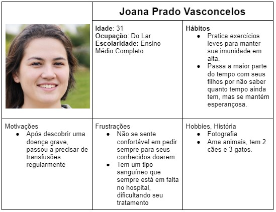
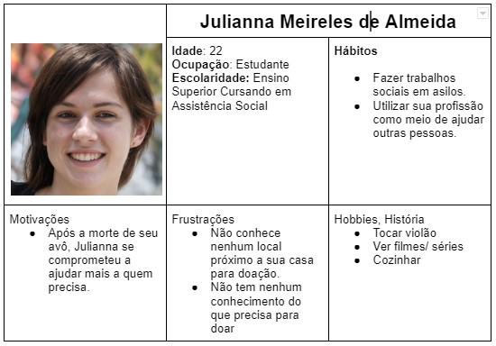
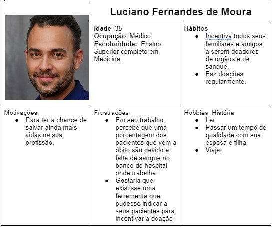

# Especificações do Projeto

Pré-requisitos: <a href="1-Documentação de Contexto.md"> Documentação de Contexto</a>

A definição exata do problema e os pontos mais relevantes a serem tratados neste projeto foi consolidada com a participação dos usuários em um trabalho de imersão feita pelos membros da equipe a partir da observação dos usuários em seu local natural e por meio de entrevistas. Os detalhes levantados nesse processo foram consolidados na forma de personas e histórias de usuários.

## Personas

As personas levantadas durante o processo de entendimento do problema são apresentadas na Figuras que se seguem.

## Histórias de Usuários

A partir da compreensão do dia a dia das pessoas identificadas para o projeto, foram registradas as seguintes histórias de usuários:

|EU COMO... `PERSONA`| QUERO/PRECISO ... `FUNCIONALIDADE` |PARA ... `MOTIVO/VALOR`                 |
|--------------------|------------------------------------|----------------------------------------|
| Julianna Meireles  | Localizar pontos de coleta de sangue próximos a minha residência. | Poder começar a doar |
| Joana Prado | Conhecer pessoas que já sejam doadores | Evitar incomodar as pessoas mais próximas |
| Luciano Fernandes | Incentivar meus pacientes a serem doadores de forma fácil e dinâmica | Movimentar um número cada vez maior de pessoas |
| Julianna Meireles | Saber se sou uma candidata a ser doadora | Não me deslocar a algum ponto de coleta a toa |
| Joana Prado | Ter maior facilidade de localizar em qual hospital tem seu tipo sanguíneo | Para fazer meu tratamento |
| Luciano Fernandes | Indicar uma ferramenta a seus pacientes para motivá-los a doar | Mais vidas sejam salvas |
| Julianna Meireles | Ter mais informações de fácil linguagem explicando sobre o assunto | Estar mais preparada sobre o que acontece no momento de doar |
| Joana Prado | Fazer cadastro de suas informações | Fazer conexões com outras pessoas que precisam de doações também |
| Luciano Fernandes | Receber lembretes próximo a data de sua doação | Não esquecer de seu compromisso |
| Julianna Meireles | Saber de curiosidades e fatos sobre doação de sangue | Ficar informada e dividir meu conhecimento com terceiros |
| Luciano Fernandes | Ter uma maneira de saber o “caminho” que o seu sangue doado percorreu | Conhecer algumas das pessoas para qual ele já fez o bem |

## Modelagem do Processo de Negócio 

### Análise da Situação Atual

Apresente aqui os problemas existentes que viabilizam sua proposta. Apresente o modelo do sistema como ele funciona hoje. Caso sua proposta seja inovadora e não existam processos claramente definidos, apresente como as tarefas que o seu sistema pretende implementar são executadas atualmente, mesmo que não se utilize tecnologia computacional. 

### Descrição Geral da Proposta

Apresente aqui uma descrição da sua proposta abordando seus limites e suas ligações com as estratégias e objetivos do negócio. Apresente aqui as oportunidades de melhorias.

### Processo 1 – NOME DO PROCESSO

Apresente aqui o nome e as oportunidades de melhorias para o processo 1. Em seguida, apresente o modelo do processo 1, descrito no padrão BPMN. 

### Processo 2 – NOME DO PROCESSO

Apresente aqui o nome e as oportunidades de melhorias para o processo 2. Em seguida, apresente o modelo do processo 2, descrito no padrão BPMN.

## Indicadores de Desempenho

Apresente aqui os principais indicadores de desempenho e algumas metas para o processo. Atenção: as informações necessárias para gerar os indicadores devem estar contempladas no diagrama de classe. Colocar no mínimo 5 indicadores. 

Usar o seguinte modelo: 

Obs.: todas as informações para gerar os indicadores devem estar no diagrama de classe a ser apresentado a posteriori. 

## Requisitos

O aplicativo de doação de sangue desempenha um papel crucial ao conectar doadores e receptores de sangue de maneira eficiente e oportuna. Para alcançar esse objetivo, é fundamental definir e compreender os requisitos essenciais do aplicativo. Nas tabelas a seguir, serão apresentados os requisitos funcionais e não funcionais que guiarão o desenvolvimento dessa plataforma.

### Requisitos Funcionais

|   ID    | Descrição do Requisito                                                | Prioridade |
|---------|-----------------------------------------------------------------------|------------|
| RF-001  | O aplicativo deve permitir que o usuário realize o cadastro            | ALTA       |
| RF-002  | O aplicativo deve permitir que os usuários efetuem o processo de login | ALTA       |
| RF-003  | O aplicativo deve permitir a exibição de uma lista de locais de doação próximos ao usuário | ALTA       |
| RF-004  | O aplicativo deve permitir a atribuição de selos com base nas doações e nível de envolvimento dos doadores | MÉDIA      |
| RF-005  | O aplicativo deve permitir que os usuários insiram os nomes das pessoas que necessitam de doações | MÉDIA      |
| RF-006  | O aplicativo deve permitir a disponibilização de um questionário para determinar a elegibilidade do usuário para doação | MÉDIA      |
| RF-007  | O aplicativo deve permitir o envio de notificações lembrando os usuários das próximas datas de doação | MÉDIA      |
| RF-008  | O aplicativo deve permitir o acesso a informações detalhadas sobre o procedimento de doação | BAIXA      |
| RF-009  | O aplicativo deve permitir a exibição de curiosidades e informações educativas relacionadas à doação | BAIXA      |
| RF-010  | O aplicativo deve permitir a implementação de um sistema de rastreamento de doações e receptores | BAIXA      |

### Requisitos não Funcionais

| ID      | Descrição do Requisito                                       | Prioridade |
|---------|--------------------------------------------------------------|------------|
| RNF-001 | Usabilidade: o aplicativo deve ter uma interface intuitiva, com botões bem definidos e fácil navegação | ALTA       |
| RNF-002 | Desempenho: o aplicativo deve ser rápido em todas as suas funcionalidades | ALTA       |
| RNF-003 | Compatibilidade: o aplicativo deve funcionar em diferentes dispositivos e plataformas | ALTA       |
| RNF-004 | Responsividade: o aplicativo deve ser responsivo para rodar em dispositivos móveis | ALTA       |
| RNF-005 | Segurança: os dados do usuário devem ser armazenados de forma segura e protegidos contra possíveis invasões ou vazamentos de informações | ALTA       |
| RNF-006 | Disponibilidade: o aplicativo deve estar disponível e acessível a qualquer momento, com tempo de inatividade mínimo | MÉDIA     |
| RNF-007 | Performance de Carregamento: o aplicativo deve carregar rapidamente, mesmo em redes de conexão mais lentas | MÉDIA     |
| RNF-008 | Escalabilidade: o aplicativo deve ser capaz de lidar com um aumento significativo no número de usuários sem perda de desempenho | MÉDIA     |
| RNF-009 | Privacidade: além de segurança, as informações pessoais dos usuários não devem ser compartilhadas indevidamente | BAIXA     |
| RNF-010 | Localização: o aplicativo deve respeitar as preferências de idioma e localização do usuário | BAIXA     |

## Restrições

As questões que limitam a execução desse projeto e que se configuram como obrigações claras para o desenvolvimento do projeto em questão são apresentadas na tabela a seguir.

|ID| Restrição                                             |
|--|-------------------------------------------------------|
|RE-01| O projeto deverá ser entregue no final do semestre letivo, não podendo extrapolar a data de 02/12/2023. |
|RE-02| O site deve se restringir às tecnologias básicas da Web no Frontend e Backend, utilizando as linguagens HTML, CSS, React e Node.       |
|RE-03| O projeto conta com a participação de cinco integrantes, que dividirão as atividades de desenvolvimento, não podendo subcontratar o trabalho. |
|RE-04| O projeto não poderá gerar custos.       |
|RE-05| O site deve seguir a convenção de nomenclatura CamelCase. |

## Diagrama de Casos de Uso

O diagrama de casos de uso é o próximo passo após a elicitação de requisitos, que utiliza um modelo gráfico e uma tabela com as descrições sucintas dos casos de uso e dos atores. Ele contempla a fronteira do sistema e o detalhamento dos requisitos funcionais com a indicação dos atores, casos de uso e seus relacionamentos. 

As referências abaixo irão auxiliá-lo na geração do artefato “Diagrama de Casos de Uso”.

> **Links Úteis**:
> - [Criando Casos de Uso](https://www.ibm.com/docs/pt-br/elm/6.0?topic=requirements-creating-use-cases)
> - [Como Criar Diagrama de Caso de Uso: Tutorial Passo a Passo](https://gitmind.com/pt/fazer-diagrama-de-caso-uso.html/)
> - [Lucidchart](https://www.lucidchart.com/)
> - [Astah](https://astah.net/)
> - [Diagrams](https://app.diagrams.net/)

# Matriz de Rastreabilidade

A matriz de rastreabilidade pode ser usada para ajudar a garantir que todos os requisitos estejam sendo atendidos e testados adequadamente, e para identificar quais partes do sistema podem ser afetadas por alterações em um requisito específico. A matriz será atualizada à medida que o sistema evolui e novas relações são identificadas.

Nesta matriz, cada linha representa um Requisito Não Funcional/Caso de Teste e cada coluna representa um Requisito Funcional/Caso de Teste. A interseção entre uma linha e uma coluna é marcada com um “X” se o requisito não funcional correspondente à linha afeta o requisito funcional correspondente à coluna. Por exemplo, a interseção entre a linha “RNF-001” e a coluna “RF-001” é marcada com um “X”, indicando que o Requisito Não Funcional “RNF-001” (Usabilidade: o aplicativo deve ter uma interface intuitiva, com botões bem definidos e fácil navegação) afeta o Requisito Funcional “RF-001” (O aplicativo deve permitir que o usuário realize o cadastro). Para os Casos de Testes que está implementado na matriz, o sistema funciona seguindo o mesmo padrão com o X marcando uma interseção em um RNF ou RF.

> **Links Úteis**:
> - [Matriz de rastreabilidade - Doe Fácil](https://sgapucminasbr-my.sharepoint.com/:x:/r/personal/1433524_sga_pucminas_br/Documents/Pasta.xlsx?d=wbebcd2de885c4dadacedbf17dac7c712&csf=1&web=1&e=i50HdO)

# Gerenciamento de Projeto

De acordo com o PMBoK v6 as dez áreas que constituem os pilares para gerenciar projetos, e que caracterizam a multidisciplinaridade envolvida, são: Integração, Escopo, Cronograma (Tempo), Custos, Qualidade, Recursos, Comunicações, Riscos, Aquisições, Partes Interessadas. Para desenvolver projetos um profissional deve se preocupar em gerenciar todas essas dez áreas. Elas se complementam e se relacionam, de tal forma que não se deve apenas examinar uma área de forma estanque. É preciso considerar, por exemplo, que as áreas de Escopo, Cronograma e Custos estão muito relacionadas. Assim, se eu amplio o escopo de um projeto eu posso afetar seu cronograma e seus custos.

## Gerenciamento de Tempo

Com diagramas bem organizados que permitem gerenciar o tempo nos projetos, o gerente de projetos agenda e coordena tarefas dentro de um projeto para estimar o tempo necessário de conclusão.

O gráfico de Gantt ou diagrama de Gantt também é uma ferramenta visual utilizada para controlar e gerenciar o cronograma de atividades de um projeto. Com ele, é possível listar tudo que precisa ser feito para colocar o projeto em prática, dividir em atividades e estimar o tempo necessário para executá-las.

## Gerenciamento de Equipe

O gerenciamento adequado de tarefas contribuirá para que o projeto alcance altos níveis de produtividade. Por isso, é fundamental que ocorra a gestão de tarefas e de pessoas, de modo que os times envolvidos no projeto possam ser facilmente gerenciados. 

## Gestão de Orçamento

O processo de determinar o orçamento do projeto é uma tarefa que depende, além dos produtos (saídas) dos processos anteriores do gerenciamento de custos, também de produtos oferecidos por outros processos de gerenciamento, como o escopo e o tempo.

