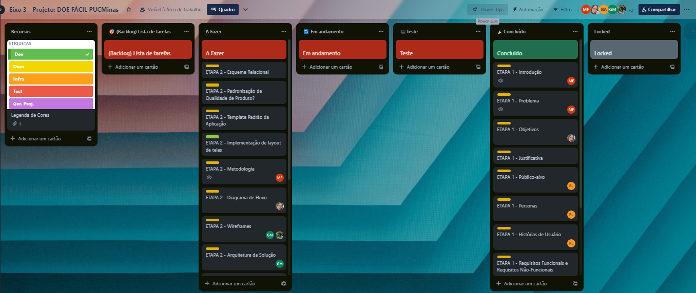

# Metodologia

Pré-requisitos: <a href="2-Especificação do Projeto.md"> Documentação de Especificação</a>

A metodologia contempla as definições de ferramentas utilizadas pela equipe tanto para a manutenção dos códigos e demais artefatos quanto para a organização do time na execução das tarefas do projeto.

## Relação de Ambientes de Trabalho

| Ambiente | Plataforma | Link de Acesso |
--------- | ---------- |  -------------  |
| Repositório de código fonte | GitHub | [GitHub](https://github.com/ICEI-PUC-Minas-PMV-ADS/pmv-ads-2023-2-e3-proj-mov-t1-doe-facil) |
| Documentos do projeto | GitHub | [GitHub](https://github.com/ICEI-PUC-Minas-PMV-ADS/pmv-ads-2023-2-e3-proj-mov-t1-doe-facil#documenta%C3%A7%C3%A3o) |
| Projeto de Interface e  Wireframes  | - | - |
| Gerenciamento do Projeto | Trello | [Trello](https://trello.com/b/v4iiDdvU/kanban-projeto-pucminas) |

## Controle de Versão

A ferramenta de controle de versão adotada no projeto foi o
[Git](https://git-scm.com/), sendo que o [Github](https://github.com)
foi utilizado para hospedagem do repositório.

O projeto segue a seguinte convenção para o nome de branches:

- `main`: versão estável já testada do software
- `unstable`: versão já testada do software, porém instável
- `testing`: versão em testes do software
- `dev`: versão de desenvolvimento do software

Quanto à gerência de issues, o projeto adota a seguinte convenção para
etiquetas:

- `documentation`: melhorias ou acréscimos à documentação
- `bug`: uma funcionalidade encontra-se com problemas
- `enhancement`: uma funcionalidade precisa ser melhorada
- `feature`: uma nova funcionalidade precisa ser introduzida

## Gerenciamento de Projeto

### Divisão de Papéis

A equipe utiliza metodologias ágeis, tendo escolhido o Scrum como base para definição do processo de desenvolvimento. A equipe está organizada da seguinte maneira:

- `Scrum Master`: Milleny Ellen Jodas Ferreira;
- `Product Owner`: Gabriel Gonçalves Morais;
- `Equipe de Desenvolvimento`: Gabriel Gonçalves Morais, Joice Ferreira Passos, Milleny Ellen Jodas Ferreira, Iane Victoria dos Santos Oliveira e Paula Elizabeth Bessa Lucio Martins;
- `Equipe de Design`: Gabriel Gonçalves Morais e Joice Ferreira Passos.

### Processo

Para organização e distribuição das tarefas do projeto, a equipe está utilizando o Trello estruturado com as seguintes listas:

- `Recursos:` esta lista mantém um template de tarefas recorrentes com as configurações padronizadas que todos devem seguir. O objetivo é permitir a cópia destes templates para agilizar a criação de novos cartões.
- `Backlog:` recebe as tarefas a serem trabalhadas e representa o Product Backlog. Todas as atividades identificadas no decorrer do projeto também devem ser incorporadas a esta lista.
- `A Fazer:` Esta lista representa o Sprint Backlog. Este é o Sprint atual que estamos trabalhando.
- `Em Andamento:` Quando uma tarefa tiver sido iniciada, ela é movida para cá.
- `Teste:` Checagem de Qualidade. Quando as tarefas são concluídas, eles são movidos para o “CQ”. No final da semana, eu revejo essa lista para garantir que tudo saiu perfeito.
- `Concluído:` nesta lista são colocadas as tarefas que passaram pelos testes e controle de qualidade e estão prontos para serem entregues ao usuário. Não há mais edições ou revisões necessárias, ele está agendado e pronto para a ação.
- `Locked:` Quando alguma coisa impede a conclusão da tarefa, ela é movida para esta lista juntamente com um comentário sobre o que está travando a tarefa.

O quadro kanban do grupo no Trello está disponível através da [URL](
https://trello.com/b/v4iiDdvU/kanban-projeto-pucminas) e é apresentado, no estado atual, na Figura abaixo. A definição desta estrutura se baseou na proposta feita por Littlefield (2016).

A tarefas são, ainda, etiquetadas em função da natureza da atividade e seguem o seguinte esquema de cores/categorias:
- Documentação
- Desenvolvimento
- Infraestrutura
- Testes
- Gerência de Projetos.

### Ferramentas

As ferramentas empregadas no projeto são:

- Editor de código: Visual Studio Code
- Ferramentas de comunicação: Microsoft Teams
- Ferramentas de desenho de tela (wireframing): -
- Ferramentas de gerenciamento do projeto: Trello
