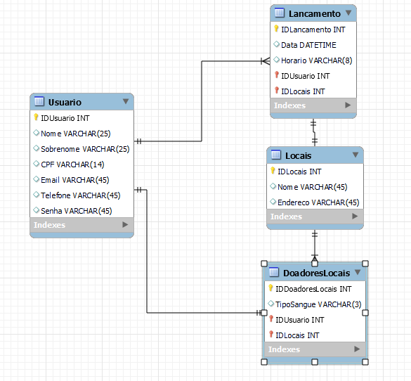

# Arquitetura da Solução

Definição de como o software é estruturado em termos dos componentes que fazem parte da solução e do ambiente de hospedagem da aplicação.

.jpg)

### Fluxo da arquitetura

1. **Usuários** fazem uma **requisição** através do **Frontend** ou do aplicativo **Mobile**.
2. A **requisição** é então encaminhada para o **Backend**, que a processa.
3. O **Backend** faz uma série de operações, que podem envolver a criação, leitura, atualização ou exclusão de dados no **MySQL**.
4. Após o processamento, uma **resposta** é gerada e enviada de volta para o **Frontend** ou **Mobile**.

Esta arquitetura permite uma segregação clara das responsabilidades e facilita futuras melhorias em cada componente individualmente.

## Diagrama de Classes

O diagrama de classes ilustra graficamente como será a estrutura do software, e como cada uma das classes da sua estrutura estarão interligadas. Essas classes servem de modelo para materializar os objetos que executarão na memória.

## Modelo ER

O Modelo ER representa através de um diagrama como as entidades (coisas, objetos) se relacionam entre si na aplicação interativa.]

## Esquema Relacional

O Esquema Relacional corresponde à representação dos dados em tabelas juntamente com as restrições de integridade e chave primária.

## Modelo Físico

Disponibilizamos o arquivo SQL do Banco de dados [AQUI](https://github.com/ICEI-PUC-Minas-PMV-ADS/Doe-Facil/tree/dev/src/bd)

## Tecnologias Utilizadas

| Nome                                    | Função de Uso                                                       |
|-----------------------------------------|---------------------------------------------------------------------|
| Whatsapp, Microsoft Teams, Discord      | Interação com stakeholders                                           |
| Github                                  | Armazenamento de código e documentação                               |
| Git                                     | Controle de versões                                                  |
| Microsoft Visual Studio                 | Ambiente de desenvolvimento de software                              |
| MYSQL WORKBENCH/DBEAVER                 | Gestão e estruturação de base de dados                               |
| Lucidchart                              | Elaboração de esquemas e fluxogramas                                 |
| Figma                                   | Prototipagem e design de UI/UX                                       |
| React, React Native, React Native Paper | Conjunto de ferramentas para desenvolvimento                         |
| HTML, CSS, JavaScript, JSON             | Linguagens para desenvolvimento                                      |
| Postman                                 | Verificação e testes de APIs                                         |
| AWS                                     | Plataforma de serviços de cloud                                      |

## Hospedagem

### Utilizando o GitHub

1. **Repositório**: Primeiramente, criamos um repositório no GitHub para armazenar nosso código-fonte e documentação. Isso nos permite fazer o versionamento e facilita a colaboração entre membros da equipe.

2. **Branching e Merging**: Utilizamos o recurso de branching para desenvolver novas funcionalidades ou corrigir bugs, e depois integramos essas alterações no branch principal através de Pull Requests.

3. **CI/CD**: Configuramos uma pipeline de Integração Contínua/Entrega Contínua para automatizar testes e outros checks antes de mesclar as alterações.

### Utilizando a AWS

1. **EC2**: Configuramos uma instância do Amazon EC2 para hospedar nossa aplicação. O EC2 nos oferece a flexibilidade de escolher o tipo de instância que melhor se adapta às nossas necessidades.

2. **S3**: Utilizamos o Amazon S3 para armazenar arquivos estáticos, como imagens, CSS e JavaScript. 

3. **RDS**: Para o banco de dados, optamos pelo Amazon RDS, que facilita tarefas como backups, patching e recuperação.

4. **Deploy**: Usamos o AWS CodeDeploy para automatizar o deploy de nossa aplicação na instância do EC2.

5. **Monitoramento**: Finalmente, configuramos o Amazon CloudWatch para monitorar o desempenho da nossa aplicação e receber alertas em caso de problemas.

Com o GitHub e a AWS, conseguimos criar um fluxo de desenvolvimento eficiente que nos permite lançar atualizações de forma rápida e segura.

## Qualidade de Software

Para definir os critérios de qualidade da aplicação, utilizaremos a Norma de Qualidade de Produto de Software ISO/IEC 9126. Assim, levantamos 6 características com 3 sub-características cada:

**1.	Funcionalidade – Refere-se a um conjunto de funções que venham satisfazer as necessidades estabelecidas nos requisitos.**
| -------------------------------------------------------------------------------- |
| **Adequação:** Será analisado se o software atende bem a demanda para qual foi proposto. Foi escolhida essa sub-característica devido a aplicação ter como foco pessoas que desejam localizar ponto de coleta de sangue. |
| **Acurácia:** Visa analisar se a aplicação gera resultados corretos e precisos como é pedido da aplicação, já que sua função é determinar locais aos quais os usuários se deslocarão, muita das vezes sem conhecer, para efetuar a coleta. |
| **Segurança:** É a capacidade de manter protegido os dados dos usuários. Sendo uma aplicação que colherá e armazenará dados sensíveis, a Segurança é uma característica extremamente importante. Esse tópico irá avaliar a segurança da senha de acesso e os dados inseridos pelo usuário. |

**2.	Confiabilidade – Trata da capacidade do software em manter seu nível de desempenho, evitando falhas.**
| ----------------------------------------------------------------------------------- |   
| **Tolerância a falhas:** Visa verificar como o software se comporta após uma falha. Se tratando de uma aplicação que pode ajudar a salvar vidas é imprescindível que o software reaja bem após uma falha. A tolerância deve ser avaliada de modo que o usuário não perca informações essenciais. |
| **Maturidade:** É a frequência com que ocorrem falhas. Quanto maior o número de falhas menos maduro estará o software. É importante para a aplicação pois uma falha pode comprometer toda a aplicação, impossibilitando que usuários possam ir aos postos efetuar doações de sangue e, consequentemente, prejudicando aqueles que mais precisam. |
| **Recuperabilidade:** Tem por foco verificar a capacidade do software de recuperar dados em um pós evento de falha. É necessário que não haja perda de dados relevantes ao usuário e que, caso ocorra, não seja de informações importantes. |

**3.	Usabilidade – Refere-se ao esforço necessário para que o usuário utilize o software.**
| ----------------------------------------------------------------------------------- |
| **Inteligibilidade:** Capacidade do software de passar o seu propósito de uso. Visando ser acessível a todas as pessoas, independente do nível de conhecimento ou idade, a aplicação deve ser de fácil interação e com um layout intuitivo. |
| **Apreensibilidade:** Refere-se ao esforço necessário por parte do usuário para aprender a utilizar a aplicação. O software deverá ser criado visando o alto aprendizado e evitando gerar esforço na utilização por parte do usuário. |
| **Atratividade:** Capacidade que o software possui de chamar atenção do usuário para algum aspecto importante de uso. Sendo uma ferramenta para auxiliar na doação de sangue, o foco estará em pontos de doação e os benefício que poderão ser recebidos através do ato, de acordo com as parcerias firmadas com empresas. |

**4.	Eficiência – Trata do nível de desempenho do software.**
| ----------------------------------------------------------------------------------- |
| **Comportamento em relação ao tempo:** Referente ao tempo de espera entre requisitar um dado e o software devolver. Em um aplicativo mobile é evidente que o usuário espera agilidade na apresentação das informações em sua tela. Com isto, aprimorar o desempenho da aplicação é fundamental. |
| **Utilização de Recursos:** Refere-se aos recursos que serão gastos para entregar o que foi requisitado. Será analisada a entrega de dados para garantir um tempo aceitável nas apresentações das informações ao usuário, sem necessitar de um grande uso de dados. |
| **Conformidade:** Visa garantir um bom nível de serviço da aplicação, onde a entrega seja compatível com a performance idealizada. Com relação a aplicação, será verificado se os resultados exibidos nas pesquisas efetuadas pelos usuários retornam valor correto. |

**5.	Manutenabilidade – Refere-se ao esforço necessário para fazer alterações e modificações no software.**
| ----------------------------------------------------------------------------------- |
| **Analisabilidade:** É o esforço de analisar o projeto e entender onde está localizado o problema a ser corrigido. Pensando numa maior facilidade para a equipe de desenvolvimento, será analisado o código e averiguado a dificuldade ou facilidade na identificação de problemas que precisam ser resolvidos. |
| **Modificabilidade:** Se refere ao esforço necessário para modificar o software. Analisar a documentação e a identação de códigos, fará com que os desenvolvedores tenham uma maior facilidade para identificar as funções de cada parte do código. |
| **Testabilidade:** É o esforço utilizado para testar o software após as alterações realizadas. A equipe de desenvolvimento visa efetuar todos os testes de usabilidade necessários para funcionamento da aplicação e, caso haja necessidade de alterações, novos testes serão realizados. |

**6.	Portabilidade - Refere-se a capacidade do software de ser transferido de um ambiente para outro.**
| ----------------------------------------------------------------------------------- |   
| **Capacidade de instalação:** Se refere a capacidade/facilidade em instalar o software. Sendo uma aplicação móvel, será feito a avaliação das possíveis dificuldades enfrentadas para a instalação do aplicativo. |
| **Coexistência:** Identifica se o software consegue coexistir bem com outros sistemas instalados. Sendo uma aplicação móvel, será avaliado se há conflitos com os sistemas operacionais móbile e outros aplicativos já instalados. |
| **Capacidade para substituir:** Busca saber se o software pode substituir um outro no ambiente operacional. A aplicação visa ser disponibilizada em todas as plataformas mobile (Android, IOS e etc), e também ter um possível diferencial referente a outras aplicações que tenham a mesma função principal. |

## Métricas

Baseando nas informações coletadas por futuros usuários da aplicação e utilizando as características e subcaracterísticas definidas previamente para ela, foi definido as seguintes métricas:

Obs: As escalas utilizadas possuem os seguintes valores:

Escala Sim/Não/Em parte

**- Sim:** Entre 100% a 70% de resposta

**- Em parte:** Entre 60% a 40% de resposta

**- Não:** Entre 30% e 0% de resposta

| Subcaracterística | Métrica | Escala | Peso |
|---------|--------------------------------------------------------------|--------------| -------------- |
| Adequação | O sistema atende a função principal de localizar pontos de coleta de sangue? | 1) Sim   2) Não   3) Em parte | Alto |
| Acurácia | O sistema entrega resultados corretos e com precisão adequada? | 1) Sim   2) Não   3) Em parte | Alto |
| Segurança | O sistema mantém segura as informações e dados coletados? | 1) Sim   2) Não   3) Em parte | Alto |
| Tolerância a falhas | O sistema se recupera de maneira eficiente após uma falha? | 1) Sim   2) Não   3) Em parte | Alto |
| Maturidade | O sistema apresenta falhas frequentes? | 1) Sim   2) Não   3) Em parte | Alto |
| Recuperabilidade | Ocorre perda de dados relevantes após uma falha? | 1) Sim   2) Não   3) Em parte | Médio |
| Inteligibilidade | O sistema  demonstra com clareza sua função? | 1) Sim   2) Não   3) Em parte | Médio |
| Apreensibilidade | É fácil utilizar a aplicação? | 1) Sim   2) Não   3) Em parte | Médio |
| Atratividade | O sistema possui algum aspecto específico que chame atenção? | 1) Sim   2) Não   3) Em parte | Baixo |
| Comportamento em relação ao tempo | O sistema demora para responder uma solicitação? | 1) Sim   2) Não   3) Em parte | Alto |
| Utilização de recursos | Os recursos utilizados entregam o que é solicitado? | 1) Sim   2) Não   3) Em parte | Alto |
| Conformidade | O sistema entrega bons resultados em conformidade com o que foi estipulado? | 1) Sim   2) Não   3) Em parte | Alto |
| Analisabilidade | É possível analisar e identificar falhas de forma eficiente? | 1) Sim   2) Não   3) Em parte | Alto |
| Modificabilidade | O sistema permite que sejam feitas alterações necessárias? | 1) Sim   2) Não   3) Em parte | Alto |
| Testabilidade | O sistema permites teste de usabilidade após cada alteração efetuada? | 1) Sim   2) Não   3) Em parte | Médio |
| Capacidade de Instalação | O sistema é de fácil instalação? | 1) Sim   2) Não   3) Em parte | Alto |
| Coexistencia | O sistema coexiste de forma natural com outras aplicações? | 1) Sim   2) Não   3) Em parte | Médio |
| Capacidade para substituir | O sistema pode substituir algum outro sistema? | 1) Sim   2) Não   3) Em parte | Baixo |
