# Programação de Funcionalidades

Acompanhando o aprendizado do Microfundamento de Desenvolvimento de Aplicações Móveis, seguimos alguns exemplos conforme as diretrizes e orientações fornecidas pelo professor Kleber Souza. Abaixo, estão as capturas de telas que demonstram o que cada um dos membros ativos do projeto desenvolveu:

## Tela Login - Responsável: Milleny

- Terminando a unidade 2 do Microfundamento de Desenvolvimento de Aplicações Móveis.
- Tela quase pronta, faltando a persistência de dados.

| 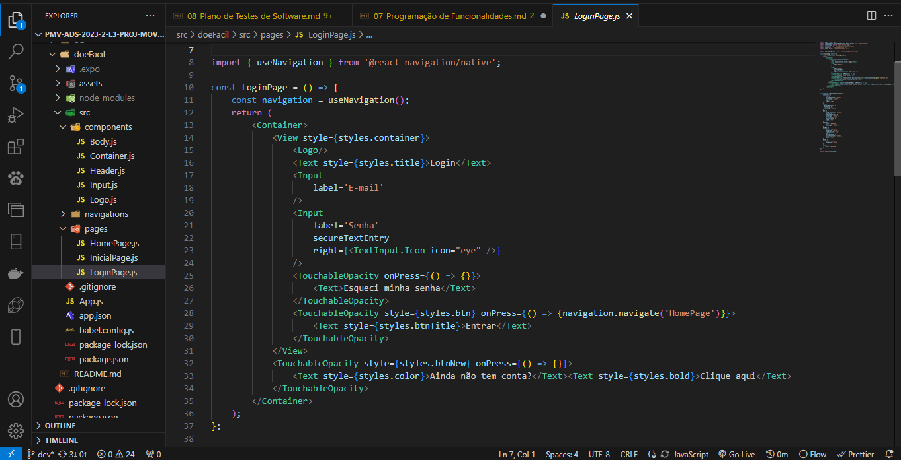 | 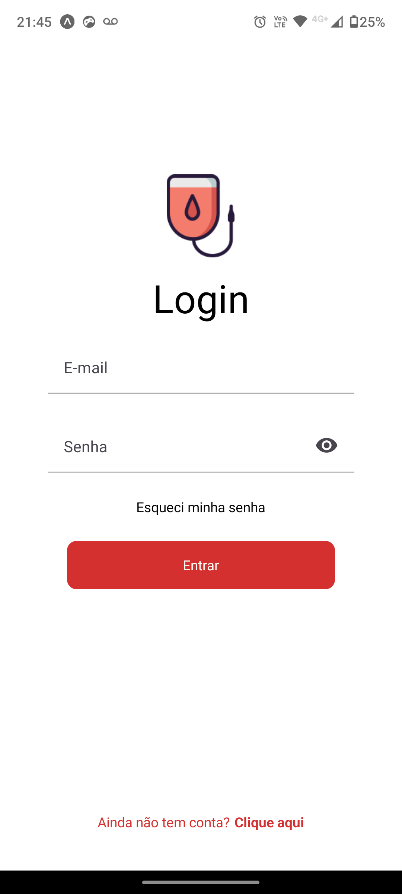 |
|:---:|:---:| 

[Visualizar todo o código](../src/doeFacil/src/pages/LoginPage.js)

## Tela Inicial da aplicação - Responsável: Milleny

- Terminando a unidade 2 do Microfundamento de Desenvolvimento de Aplicações Móveis.
- Falta algumas implementações, mas está quase pronta.

| 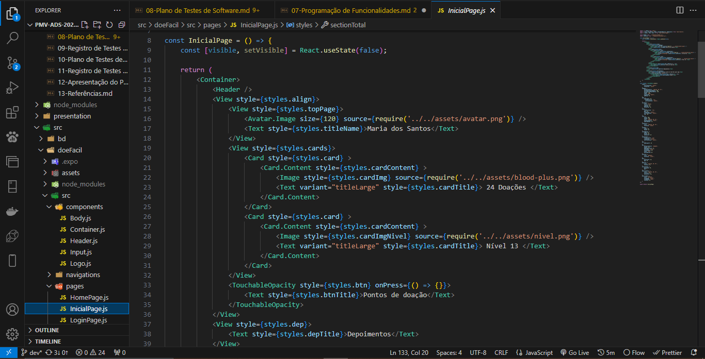 | 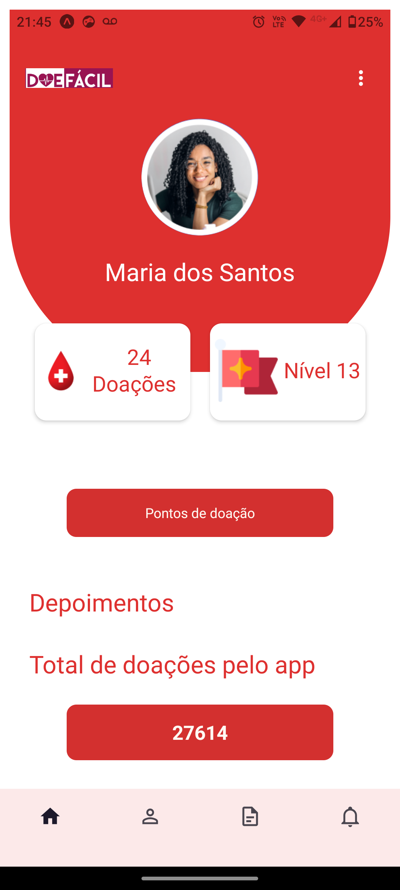 |
|:---:|:---:|

[Visualizar todo o código](../src/doeFacil/src/pages/InicialPage.js)

## Tela Informativo Inicial (InfoInicial) - Responsável: Iane Victória

- Saliento que foi adicionado "barra de rolagem" nessa tela.
- Foi utilizado componentes nessa tela, em especifíco, são os cards.

| 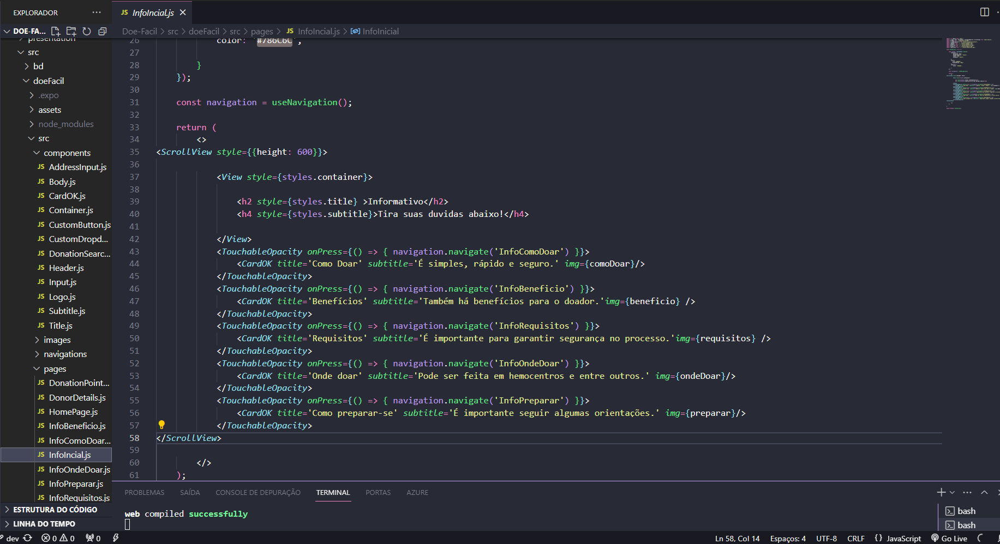 | 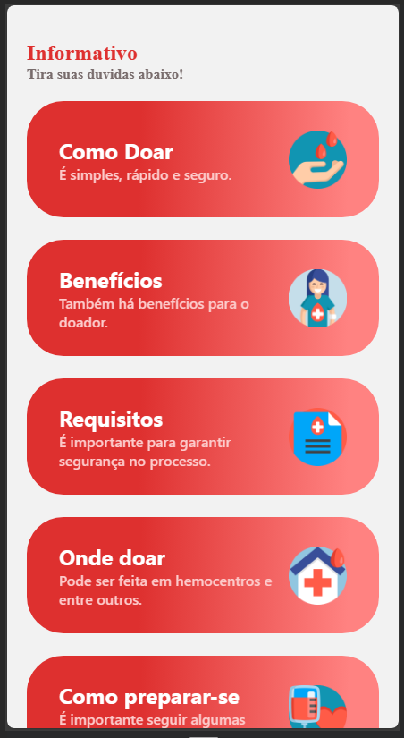 |
|:---:|:---:| 

[Visualizar todo o código](../src/doeFacil/src/pages/InfoInicial.js)

- Complementando, aqui podemos visualizar a utilização de componentes. De forma resumida, notei que o código do card poderia ser reutilizado, dessa forma, o fiz.
- Práticas aplicadas conforme os ensinamentos das aulas do professor Kleber.

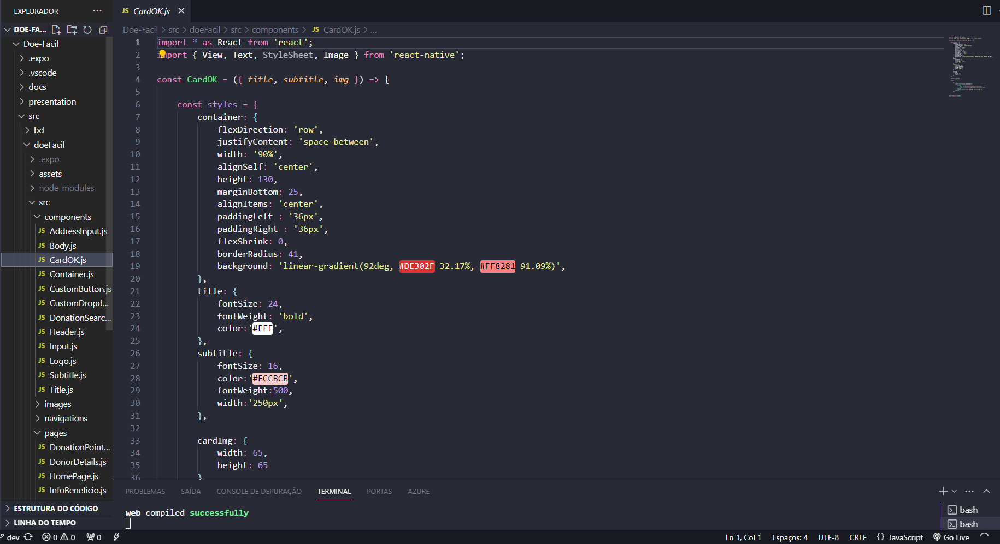 

[Visualizar todo o código](../src/doeFacil/src/components/CardOK.js)

## Tela Como Doar (InfoComoDoar) - Responsável: Iane Victória

| 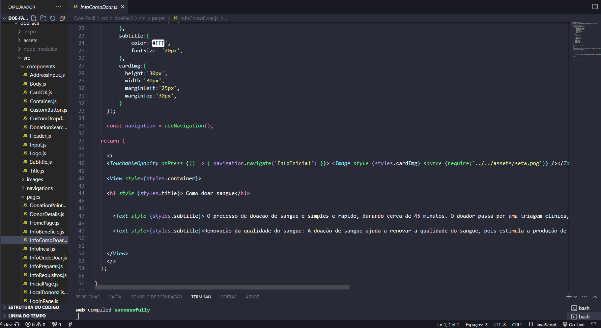 | 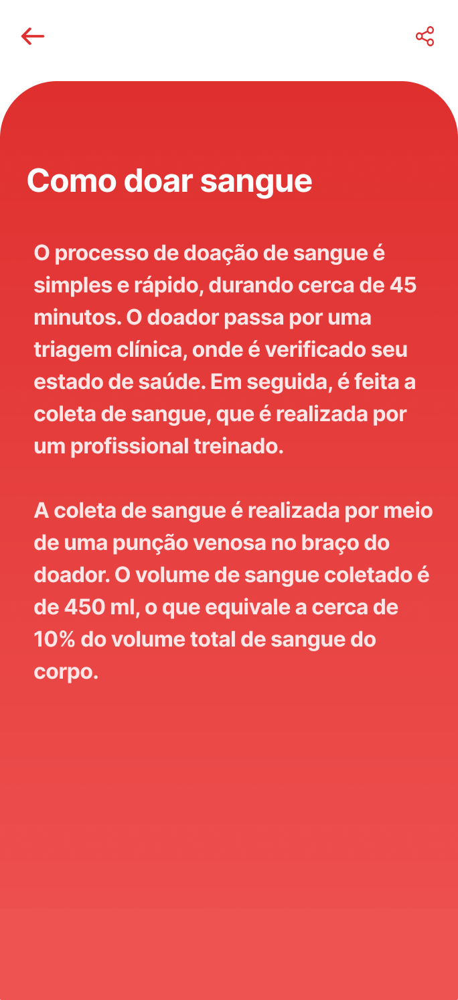 |
|:---:|:---:| 

[Visualizar todo o código](../src/doeFacil/src/pages/InfoComoDoar.js)

## Tela Beneficio (InfoBeneficio) - Responsável: Iane Victória

| 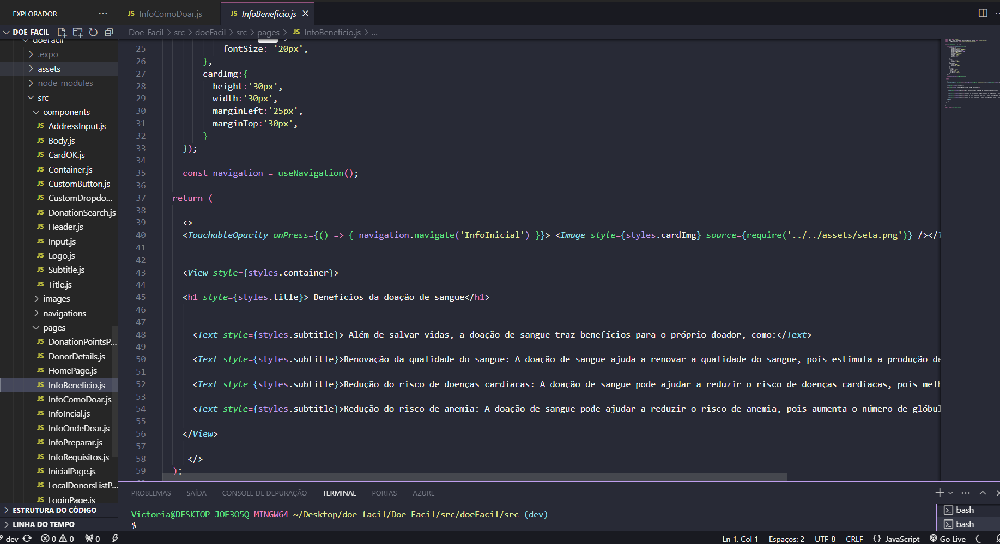 | 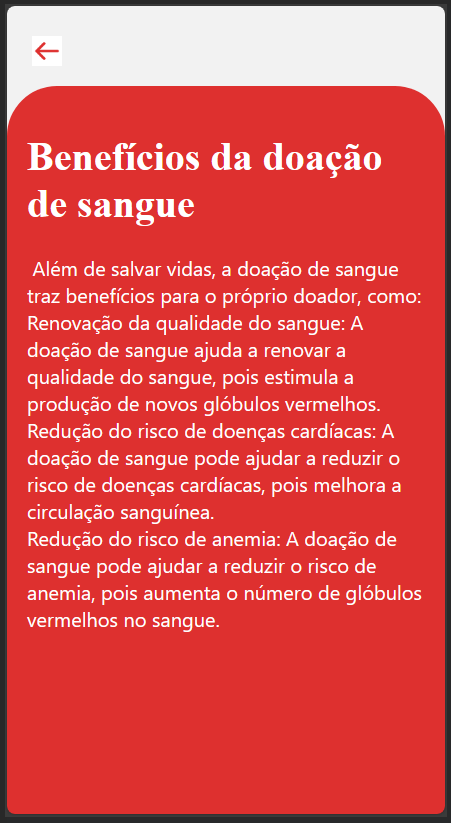 |
|:---:|:---:| 

[Visualizar todo o código](../src/doeFacil/src/pages/InfoBeneficio.js)

## Tela Onde Doar (InfoOndeDoar) - Responsável: Iane Victória

| 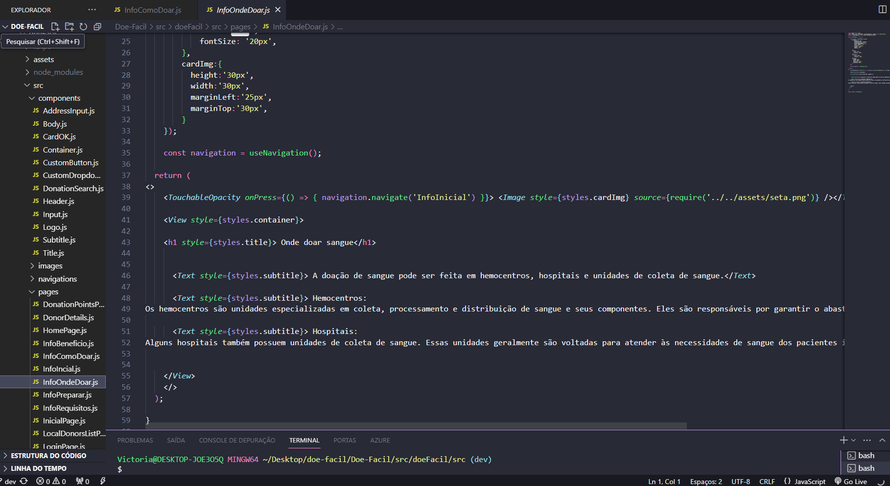 | 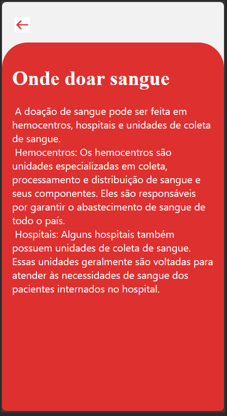 |
|:---:|:---:| 

[Visualizar todo o código](../src/doeFacil/src/pages/InfoOndeDoar.js)

## Tela Requisitos (InfoRequisitos) - Responsável: Iane Victória

| 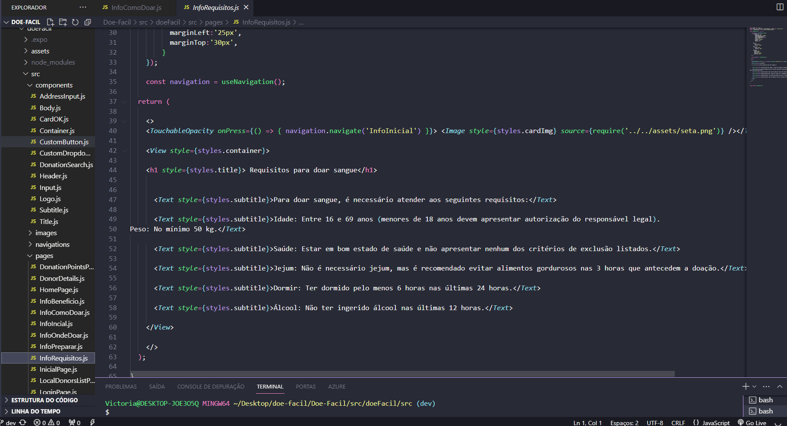 | 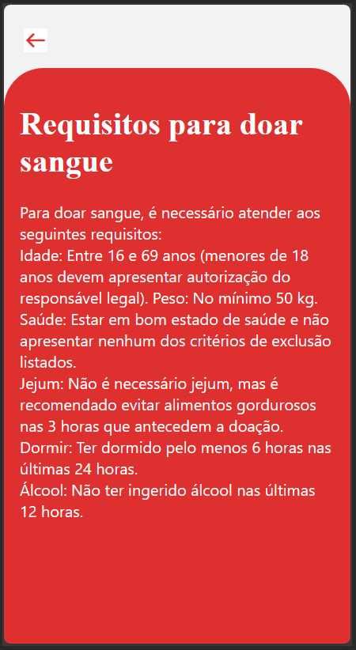 |
|:---:|:---:| 

[Visualizar todo o código](../src/doeFacil/src/pages/InfoRequisitos.js)

## Tela Preparar-se (InfoPreparar) - Responsável: Iane Victória

| 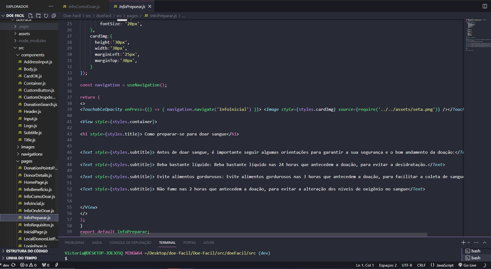 | 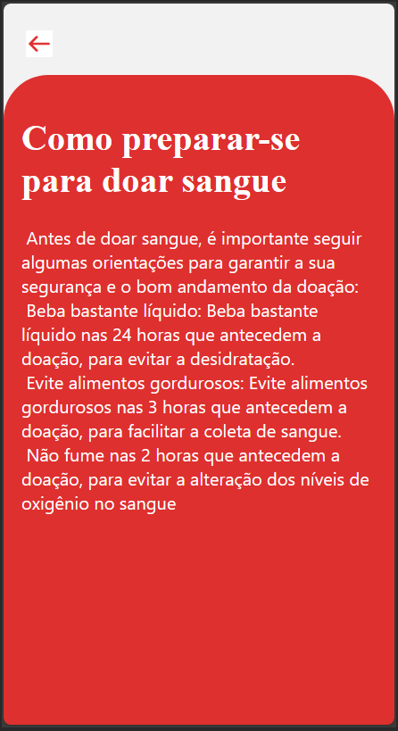 |
|:---:|:---:| 

[Visualizar todo o código](../src/doeFacil/src/pages/InfoPreparar.js)
